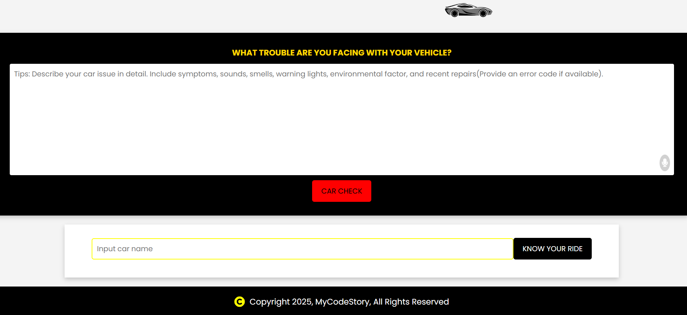

# My Awesome Project
Car Check App is an intelligent vehicle support assistant that helps users diagnose car issues using natural language and provides quick access to car specifications by simply typing in the car name or model. It combines AI-powered diagnostics with instant vehicle information lookup in one platform.

**Link to project:** https://car-check-iota.vercel.app/

## How It's Made:

**Tech used:** AI Integration: Gemini API (Google Generative AI)

Car Check App solves a practical problem for everyday drivers who experience issues with their vehicles but lack the technical knowledge to describe or fix them. Users can simply describe what they notice—like “the engine is making a rattling noise”—and the app uses the Gemini API to suggest possible issues, fixes, and maintenance tips.

AI-Powered Diagnostics: Users type in what they observe about their vehicle, and the app uses Gemini API to generate accurate, conversational feedback on what might be wrong and how to fix it.
Vehicle Detail Lookup: Users can type in any car make/model (e.g., "Toyota Camry 2018") to instantly retrieve key specifications and insights.
User-Friendly Experience: Focused on simplicity—no need for technical language; just describe what you see or hear.

## What makes this standout:
AI-Powered Structured Feedback: Not just chat-based answers—Gemini API returns insights in a consistent, well-organized format to guide the user logically.
Practical problem-solving mindset with real-world applications.
Demonstrates ability to integrate external APIs and handle dynamic user input effectively.

## Optimizations

Mechanic Finder: Suggest nearby certified mechanics based on user location.
Smart Cost Estimator: Use AI + external APIs to estimate realistic repair costs.
User Authentication: Personalized dashboard for saved vehicles and past interactions.
 Save History: Store previous diagnoses for reference and comparison.

## Lessons Learned:

Building Car Check App deepened my understanding of prompt engineering, natural language parsing, and designing AI-enhanced UX. I also gained valuable experience in managing state and building scalable UI components that make technical data accessible to non-technical users.

## Examples:
Take a look at these couple examples that I have in my own portfolio:

**Marketplace:** https://1marketplace.vercel.app/marketplace

**Post-Check** https://post-checkapp.onrender.com/

**MyTestimony:** https://mytestimony.vercel.app/

